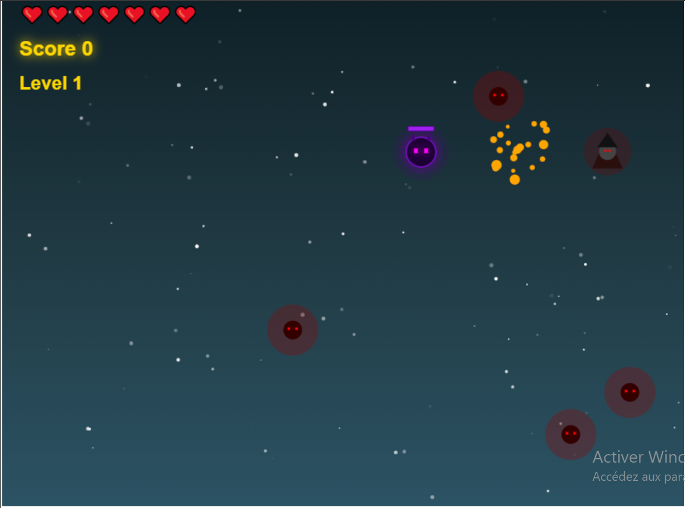

# 2D-Flat-Heroes

# About
**Wizard Battle** is a minimalist 2D arcade survival game inspired by *Flat Heroes*. 
Built entirely from scratch using **JavaScript (ES6)** and the **HTML5 Canvas API**, this project demonstrates low-level game development techniques without relying on external game engines like Phaser or Unity.

The game features procedural audio synthesis and vector-based AI.

**Play the demo here:** [https://souadaqabli.github.io/2D-Flat-Heroes/]

## 🎮 How to Play
Survive the waves of enemies, use your magic spells to defeat them, and dash to avoid damage.

### Controls
| Action | Key | Description |
| :--- | :--- | :--- |
| **Move** | `WASD` or `Arrow Keys` | Navigate the arena |
| **Shoot** | `F` | Cast a magic spell in the moving direction |
| **Dash** | `SPACE` | Quick burst of speed to dodge enemies |
| **Restart** | `R` | Restart the game after Game Over |

## ✨ Key Features

### 🕹️ Core Mechanics
* **Wave System:** Infinite progression with increasing difficulty (more enemies, new types).
* **Combat:** Health system (Hearts), invincibility frames, and knockback physics.
* **Visuals:** Particle explosions, glowing effects, and smooth animations using the Canvas API.

### 🤖 Reactive AI
The enemies are not scripted paths but use **reactive steering behaviors**:
1.  **Bouncers:** roam the map using simple geometric reflection logic.
2.  **Chasers (Mini-boss):** Implement a **Vector-based Seek Algorithm**. They calculate the normalized vector towards the player every frame to create a fluid pursuit behavior (`dx/dy` normalization).

### 🔊 Procedural Audio (Tone.js)
Instead of using static MP3 files, the audio is **synthesized in real-time** using **Tone.js**.
* **Dynamic Sound:** Hits, shots, and dashes are generated using FM Synths and oscillators.
* **Generative Music:** An ambient background track is composed algorithmically, ensuring the music never loops repetitively.

## ⚔️ Gameplay Mechanics

The goal is to survive endless waves of enemies within the arena while achieving the highest score possible.

* **❤️ Health System:** The player starts with **5 Lives**. Colliding with an enemy removes one life and triggers a temporary invincibility period (knockback effect).

* **👾 Enemy Types:** You will face two distinct threats:
    * **The Chasers (Purple):** Aggressive mini-bosses that actively track your position using a seeking algorithm. They are tough and require **3 hits** to be defeated.
    * **The Bouncers (Red):** They move chaotically, ricocheting off walls to restrict your movement. They require **2 hits** to destroy.

* **🎯 Scoring:**
    * Each successful shot grants immediate points.
    * Destroying an enemy awards a significant **Score Bonus** (up to 100 points).
    
* **🚀 Progression:**
    * **Wave System:** You must defeat **every enemy** on the screen to trigger the "Level Up" event.
    * Each new level spawns more enemies and increases the proportion of Chasers.

## 🛠️ Technical Implementation

### Architecture
The project follows a strict **Object-Oriented Programming (OOP)** structure using ES6 Modules:

/JS-PROJECT
  ├── index.html        # Entry point
  ├── main.js           # Module loader
  ├── style.css         # Basic styling
  ├── Game.js          # Main loop, state management, entity pooling
  ├── Player.js        # Physics, input handling, dash logic
  ├── Enemy.js         # Base enemy logic (Bouncers)
  ├── EnemyChaser.js   # Advanced AI logic 
  ├── Spell.js         # Projectile logic
  ├── Particle.js      # Visual effects system
  ├── SoundManager.js  # Audio synthesis via Tone.js
  ├── Input.js         # Event listeners wrapper
  └── collision.js     # Custom AABB collision detection